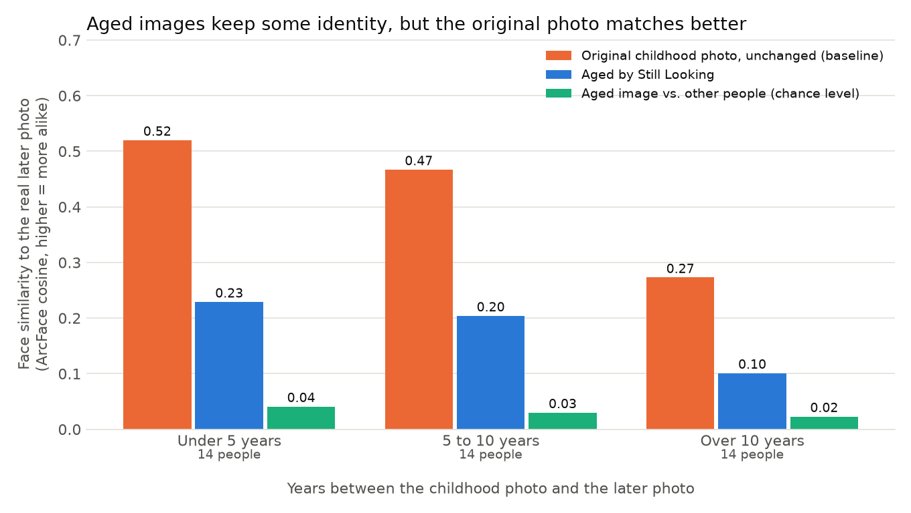

# Still Looking

**An honest way for families of long-term missing children to picture how their child may have grown up.**

A parent uploads a photo of their child, the child's date of birth and roughly when the photo was taken.
Optionally they add photos of biological parents or siblings and a list of distinguishing marks.
Still Looking creates **three** possible images of the child at their age today, together with a
confidence note based on measured results, not a single "this is your child" picture.

> Built solo for **Beginner's Paradise – FirstCommit** (Devpost), Sep 2026.
> This project uses significant AI assistance; see [AI assistance](#ai-assistance-disclosure).

---

## The problem

When a child has been missing for years, the only photo their family has may show a face that no
longer exists. Forensic artists (for example at NCMEC in the US) age those photos, often using
pictures of the child's parents and siblings to see which features run in the family. That help is
valuable but limited, and families can wait a long time. Consumer AI "aging" apps exist, but they
use a single photo, keep uploads, and never say how accurate they are.

## Who it's for

Families and the people helping them (case workers, volunteers) who want an early, private way to
picture a missing child today, to bring to the police or a missing-children organisation.
**It is not an identification tool and it does not search for anyone.**

## What makes it different

| | Typical AI aging app | Still Looking |
|---|---|---|
| Inputs | One photo | Child photo + optional family photos + family-confirmed distinguishing marks |
| Output | One confident image | 3 variations + a confidence note from real test results |
| Accuracy | Not published | [Measured on a public dataset](#accuracy-results), including where it fails |
| Privacy | Uploads often stored | No accounts, no database, no storage; photos go only to the image model and are deleted right after |

## How it works

```
Browser                                Server (Next.js API route)           Image models
───────                                ──────────────────────────           ────────────
frame the face, shrink ─►  /api/generate: check inputs,       ─► 1st: Nano Banana 2 (Google, via Replicate)
to ≤500px (originals          compute ages, build prompt            3 images; uploads deleted right after
never leave the device)                                        ─► backup: FLUX.2 [klein] 4B (Cloudflare, free)
                                                                   for any image the first model couldn't make
                         ◄──  return images + which model made each (nothing saved)
show 3 variations + confidence note for that model
(images live only in page memory; closing the page deletes them)

optional: "Suggest from the photo" ─► /api/features ─► Gemma 4 vision model (Cloudflare) suggests
the family edits the list before use                    moles, scars, eye colour…
```

- **Age math:** age in photo = photo date − date of birth; target age = today − date of birth.
- **Prompt:** written in plain, positive language that names the life stage ("the age of a university
  student") and the physical changes of growing up. We learned this through testing; see [LEARNING.md](LEARNING.md).
- **Family photos** are passed to the model as extra reference images, labelled by relationship and age.
  The model *sees* them, but we could not measure whether they improve accuracy (see Limitations).
- **Distinguishing features** are suggested by a vision model and **confirmed by the family** before use.
  The model is told not to guess race or ethnicity.

### Tech stack

- **Next.js 16** (App Router, TypeScript, Tailwind CSS), deployable on Vercel's free tier
- **Replicate** (paid, ~$0.067 per image): `google/nano-banana-2`, the main image model, chosen because it
  measurably kept identity best in our eval. Photos are uploaded to Replicate's file store only for the request
  and deleted by the app straight after; Replicate deletes API request data after an hour
  ([data retention](https://replicate.com/docs/topics/predictions/data-retention)).
- **Cloudflare Workers AI** (free plan): `@cf/black-forest-labs/flux-2-klein-4b` as the backup image model and
  `@cf/google/gemma-4-26b-a4b-it` for feature suggestions. Cloudflare states it does not store or train on
  inputs/outputs ([data usage policy](https://developers.cloudflare.com/workers-ai/platform/data-usage/)).
- **Evaluation:** Python, InsightFace (ArcFace face recognition), matplotlib

---

## Setup

### Requirements

- Node.js **24** or newer
- A free Cloudflare account (no credit card needed)
- Optional: a Replicate account with a little credit for the main model; without it the app uses the free model

### Run the app locally

```bash
git clone <this-repo-url>
cd still-looking
npm install
cp .env.example .env.local      # then fill in the values below
npm run dev                     # open http://localhost:3000
```

### Environment variables

| Variable | Where to get it |
|---|---|
| `CLOUDFLARE_ACCOUNT_ID` | Cloudflare dashboard → AI → Workers AI → "Use REST API" |
| `CLOUDFLARE_API_TOKEN` | Same page → "Create a Workers AI API Token" (default permissions are fine) |
| `REPLICATE_API_TOKEN` | Optional. replicate.com → Account → API tokens. Enables Nano Banana 2; leave empty for free-only |
| `AI_MODE` | Optional, development only: `mock` (no AI calls) or `cheap` (1 free image at 512px). Leave empty when deployed |

Never commit `.env.local`; it is git-ignored.

**Free-tier note:** Cloudflare's free plan allows 10,000 "neurons" of AI use per day (about 45 app runs of
3 images). When it runs out, the app shows a clear message. In practice the allowance sometimes takes
longer than the documented 00:00 UTC to come back.

---

## Accuracy results

> Eval run on **42 people** from FG-NET, 3 aged images each (126 images).
> Full numbers: [`eval/outputs/summary.json`](eval/outputs/summary.json) · per-person: [`eval/outputs/results.csv`](eval/outputs/results.csv)



| | Original childhood photo (do nothing) | **Aged by Still Looking** | Other people (chance) |
|---|---|---|---|
| Similarity to the real later photo (ArcFace) | 0.42 | **0.17** | 0.03 |
| Right person ranked first among 42 | 86% | **45%** | – |
| Aged image beat the original photo | – | **0 of 42** | – |
| Aged image closer to the right person than to strangers | – | **90%** | – |

By age gap (right person ranked first, original photo / aged image): under 5 years 93% / 57% ·
5–10 years 100% / 64% · over 10 years 64% / **14%**. Full table: [`eval/outputs/results_table.md`](eval/outputs/results_table.md).

**The app's main model now is Nano Banana 2** (see the experiments below): one image per person, right person
ranked first 43% (under 5 years) · 57% (5–10) · **43% (over 10, vs 14% for the free model)**, while the original
photo scores 93% · 100% · 64%. It helps most for the long gaps this app is for, but never beats the original photo.

**Can it be improved?** (same photo, only one thing changed)

| Experiment | People | Similarity: normal → with it | 95% range of the change | Verdict |
|---|---|---|---|---|
| Up to 2 extra childhood photos | 31 | 0.187 → 0.169 | −0.044 to +0.007 | No measurable help |
| AI-suggested features (unchecked by a family) | 18* | 0.168 → 0.167 | −0.031 to +0.022 | No measurable help |
| An *editing* model (SAM) instead of our *redrawing* model | 38† | 0.172 → 0.204 | −0.003 to +0.066 | Slightly better identity, not yet conclusive; ages faces too little |
| **Nano Banana 2 instead of FLUX** (now the app's main model) | 42 | 0.173 → **0.208** | **+0.003 to +0.070** | **Measurable improvement**; right age and sex more often |

\*The free quota ran out partway; 7 more people had no clear features to add. On old, blurry scans the vision model
mostly found only "dark eyes" or "thick eyebrows", so this is a weak test of the idea: real families can add marks
(scars, birthmarks) a photo can't show.
†SAM ([Alaluf et al., 2021](https://github.com/yuval-alaluf/SAM), run via Replicate) could not find a face in 4 of the 42 old photos.

**In plain words:** the aged images keep part of the child's identity (far above chance), but a
face-recognition model matched the **original** childhood photo to the grown-up person better than our
aged images, for every person. The image model tends to "beautify" faces into smooth, symmetrical
stock-photo faces, which removes individual features. Accuracy drops a lot for gaps over 10 years.

That's why the app presents results as *a way to picture how a child may have grown*, **always**
tells families to share the original photo too, and never calls the images identification.

### How we measured

1. **Dataset:** [FG-NET](https://yanweifu.github.io/FG_NET_data/): 82 people, 1,002 photos, ages 0–69
   (research use only, so it's **not** included in this repo; download it yourself).
2. **Pairs:** 42 people with a childhood photo (≤12) and a later photo, 14 per age-gap group
   (<5, 5–10, >10 years), one pair per person, fixed random seed ([`eval/select_pairs.py`](eval/select_pairs.py)).
3. **Generation:** each childhood photo is aged with **the app's own code** (same prompt builder,
   same model, 3 variations) ([`eval/generate.mjs`](eval/generate.mjs)).
4. **Scoring:** InsightFace ArcFace cosine similarity to the real later photo, compared with
   (a) the unchanged childhood photo and (b) other people's later photos; plus a rank test
   ([`eval/score.py`](eval/score.py)). The prompt was tuned on 5 *different* people, not the test set.
5. **Experiments:** extra childhood photos (`--multi`) and AI-suggested features (`--features`),
   each changing one thing with the same seed.

### Reproduce the eval

```bash
python -m venv eval/.venv
eval/.venv/Scripts/pip install -r eval/requirements.txt    # macOS/Linux: eval/.venv/bin/pip
# put FG-NET images in data/FGNET/images/  (e.g. from https://yanweifu.github.io/FG_NET_data/)
eval/.venv/Scripts/python eval/select_pairs.py             # first run downloads InsightFace buffalo_l (~290 MB)
npm run eval:all                                           # generate (uses free quota), experiments, score
```

---

## Limitations

- **Not better than the original photo** on machine face-matching (see results).
- **Family photos are not measured.** No public dataset has a child's photos over time *and* their
  parents' photos, so family mode is shown only as an example, not measured.
- **Age not verified.** The age-estimation model we tried guessed most children as adults even in
  real photos, so we can't claim the images show exactly the right age.
- **Small, old dataset.** FG-NET has 82 people, mostly scanned prints, and doesn't represent every
  ethnicity or age range. More than half the test childhood photos are of babies (0–3 years).
- **Machine view only.** ArcFace similarity stands in for "does it look like them?"; we have not tested
  whether people recognise the images better.
- **Free-tier limits.** 10,000 neurons/day shared by everyone using the deployed demo.
- **The model can invent faces.** Given a cartoon, it still produced realistic teenagers. It never says
  "I can't tell", which is why the app never shows a single answer.

## Safety and privacy by design

- No login, no database, no image storage, no gallery, no sharing features.
- Photos are framed and shrunk in the browser; only the small copy is sent, to the image model only.
  The app deletes it from Replicate as soon as the images are made (Replicate also deletes request data
  within an hour); Cloudflare states it keeps nothing.
- Results stay in the page's memory; refreshing or closing the page deletes them.
- The app does not search for, match or identify anyone. It only creates images for the uploader.
- Every page states: *this is an estimate, not identification*, and points to the police and NCMEC
  (1-800-THE-LOST in the US).
- The AI is never asked to infer race or ethnicity.

## AI assistance disclosure

This project was built with significant help from **Claude Code (Anthropic)**, an AI coding assistant.
<!-- TODO(owner): rewrite this section in your own words before submitting. -->
- **AI wrote most of the code** (Next.js app, API routes, evaluation scripts) and helped research model
  providers, pricing and privacy terms.
- **I made the product decisions**: the idea and its safety rules, choosing the free provider after
  rejecting options that store or train on photos, keeping the honest framing after the eval came back
  negative, adding the distinguishing-features idea, and what to cut.
- **I tested** the app myself and caught problems (for example, results that still looked like children).
- The decisions, problems and what I learned are logged day by day in [LEARNING.md](LEARNING.md).

AI models used **inside** the product: Nano Banana 2 (main image model), FLUX.2 [klein] 4B (backup image model), Gemma 4 (feature
suggestions), InsightFace buffalo_l (evaluation only; non-commercial research licence).

## Acknowledgements

- FG-NET Aging Database (research use).
- InsightFace, Black Forest Labs (FLUX.2), Google (Gemma), Cloudflare Workers AI.
- The forensic artists at NCMEC whose family-guided method inspired this project.

## License

The **code** in this repository is released under the [MIT License](LICENSE).
This does **not** cover third-party data or models, which keep their own terms:
the FG-NET dataset (research use only; not included here), InsightFace buffalo_l models
(non-commercial research use; downloaded separately), and the AI models used through
Cloudflare Workers AI (their providers' terms).
